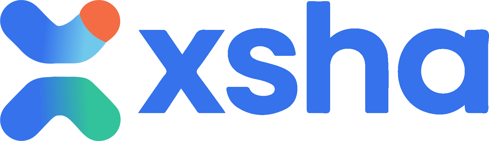
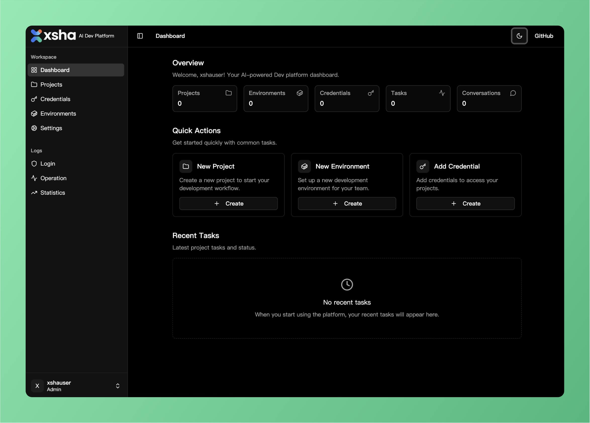

<div align="center">





# 🚀 xsha - AI-powered project development platform

[X](https://x.com/0xTYZ) • [ProductHunt](https://www.producthunt.com/products/xsha)

</div>

xsha is a software system that combines project management, Git, and AI-driven development. Based on Claude Code, it enables project task development through conversational interactions, with multiple tasks running concurrently, each with its own isolated workspace. Docker containers are used to allocate execution environments for each task, ensuring security. With ENV variable configuration, you can easily integrate more cost-effective large language models like Kimi K2, GLM 4.5, and Qwen Coder. ✨

## 🔥 Core Features

- **🧠 AI-Driven Project Task Automation:** Built on Claude Code, with development capabilities limited only by Claude Code's potential. Also supports models like Kimi K2/GLM 4.5/Qwen Coder.
- **🛡️ Isolated Execution Environments:** Docker-based container solution ensures each Claude Code execution runs in its own isolated container for security.
- **⚡ Concurrent Task Execution:** Controllable concurrency allows for faster project task development.
- **🔄 Git Integration:** Directly import Git repositories, push completed project tasks to repositories with one click, and view Git diffs online.
- **⏰ Scheduled Task Execution:** Support for automated task scheduling and execution at specified times with ultrathink capabilities.
- **📎 Rich Attachment Support:** Upload and process images, PDFs, and other file attachments for enhanced task context.
- **📋 Project Kanban Management:** Visual task management with drag-and-drop Kanban boards for better project organization.

## 🏃‍♂️ Quick Start

1. 📥 **Clone the repository**

```bash
git clone https://github.com/XshaLabs/xsha.git && cd xsha
```

2. 🚀 **Start the application**

```bash
sudo chmod 666 /var/run/docker.sock && docker compose up -d
```

3. 🌍 **Access the application**

- **Frontend**: http://localhost:8080

4. 🔑 **Default credentials**

- **Username**: xshauser
- **Password**: xshapass

## 💻 Local Development

### 📋 Prerequisites

- **Docker & Docker Compose**: For containerized deployment 🐳
- **Go 1.21+**: For local development (optional) 🐹
- **Node.js 18+**: For frontend development (optional) 📦
- **Make**: For build automation (optional) 🔨

### 🚀 Getting Started

1. 🗄️ **Backend setup**

```bash
cd backend
make deps          # Download dependencies
make dev           # Start development server
```

2. 🎨 **Frontend setup**

```bash
cd frontend
npm install        # Install dependencies
npm run dev        # Start development server
```

## 🤝 Contributing

We welcome contributions from the community! Here's how you can get involved: 🎉

### 🛠️ Development Setup

1. 🍴 **Fork the repository** and clone your fork
2. 🌿 **Create a feature branch**: `git checkout -b feature/amazing-feature`

### 📝 Pull Request Process

1. ✅ **Ensure tests pass** and coverage is maintained
2. 📚 **Update documentation** for any API changes
3. 📋 **Follow the PR template** and provide clear descriptions
4. 👀 **Request review** from maintainers

### 🐛 Issues and Bug Reports

- 📄 Use the issue templates provided
- 🔍 Include reproduction steps and environment details
- 🏷️ Label issues appropriately (bug, enhancement, question, etc.)

## 📄 License

This repository is licensed under the [xsha Open Source License](LICENSE), based on Apache 2.0 with additional conditions. ⚖️

---

**Built with ❤️ by the xsha team** 👨‍💻👩‍💻
